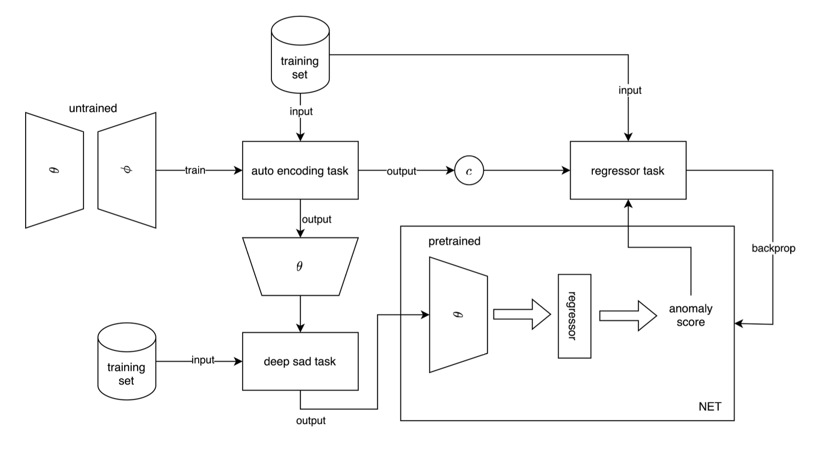
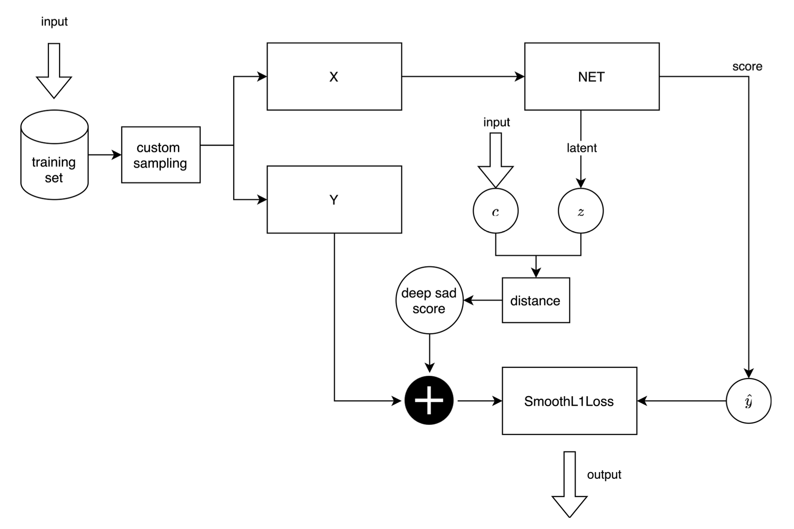

# DPLAN 
# A Pytorch implementation
## author: Teodoro Sullazzo

This repository contains an implementation of an anomaly detection method called DPLAN, which is based on the reinforcement learning framework. The method is described in the paper "Toward Deep Supervised Anomaly Detection: Reinforcement Learning from Partially Labeled Anomaly Data" by Pang et al. You can access the paper [here](https://arxiv.org/pdf/2009.06847.pdf).

There are some differences between the work presented here and the original work by Pang et al.:

- I introduced the set $D_n$, which contains known normal data.
- I utilized a different kind of normalization for the Isolation Forest score.
- I changed how the reward is computed for the extrinsic reward.
- This implementation is based on the Pytorch framework.
- There are also some other minor changes.

The code in env.py is derived from the code provided by the Github user lflfdxfn.

## UPDATE - 13/12/2023
Added preprocessing for UNSW-NB15 dataset according to Pang et al's paper. It can be find in the preprocessing folder. 

## DRAN

The repository also includes a new method based on DPLAN called DRAN that removes the reinforcement learning component by using a regression layer. The method's workflow is described below.

